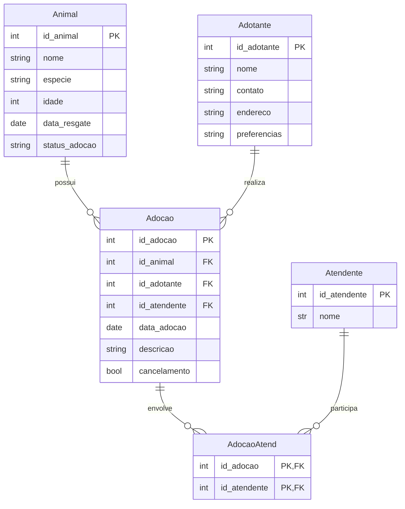

```mermaid
erDiagram
    Animal {
        int id_animal PK
        string nome
        string especie
        int idade
        date data_resgate
        string status_adocao
    }

    Adotante {
        int id_adotante PK
        string nome
        string contato
        string endereco
        string preferencias
    }

    Adocao {
        int id_adocao PK
        int id_animal  FK
        int id_adotante FK
        int id_atendente FK
        date data_adocao
        string descricao
        bool cancelamento
    }
    AdocaoAtend{
        int id_adocao PK, FK
        int id_atendente PK, FK
    }
    
    Atendente {
        int id_atendente PK
        str nome
    }

   
    Animal ||--o{ Adocao : "possui"
    Adotante ||--o{ Adocao : "realiza"
    Adocao ||--o{ AdocaoAtend : "envolve"
    Atendente ||--o{ AdocaoAtend : "participa"
```
