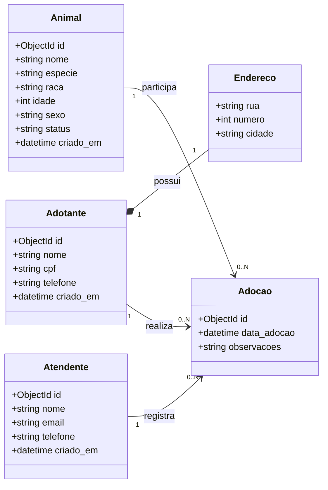
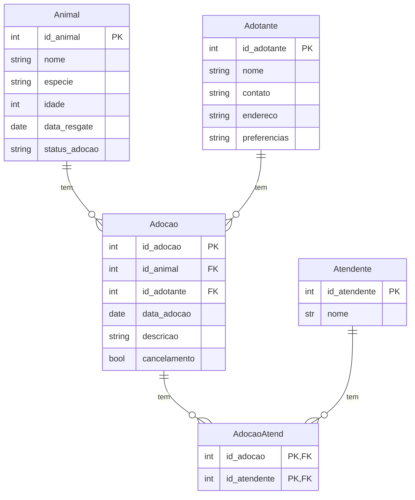

Este projeto implementa uma API REST para gerenciamento de um sistema de adoção de animais, utilizando FastAPI, SQLModel, Alembic e SQLite/PostgreSQL (local e na nuvem usando o supabase).

# Diagrama de Classe:


# Diagrama ER:

PS: A tabela AdocaoAtend é uma tabela associativa, necessária para representar o relacionamento muitos-para-muitos entre Adocao e Atendente.

## Animais

| Método | Endpoint | Descrição |
|------|---------|-----------|
| GET | `/animais/stats/status/0` | Total de animais disponíveis |
| GET | `/animais/stats/status/1` | Total de animais adotados |
| GET | `/animais/detalhes` | Animais adotados (com detalhes) |
| PUT | `/animais/{animal_id}` | Atualizar animal |
| DELETE | `/animais/{animal_id}` | Deletar animal |


---

## Adotantes

| Método | Endpoint | Descrição |
|------|---------|-----------|
| POST | `/adotantes/` | Criar adotante |
| GET | `/adotantes/` | Listar adotantes |
| GET | `/adotantes/buscar/nome` | Buscar adotante por nome |
| GET | `/adotantes/{adotante_id}` | Buscar adotante por ID |
| PUT | `/adotantes/{adotante_id}` | Atualizar adotante |
| DELETE | `/adotantes/{adotante_id}` | Deletar adotante |

---

## Atendentes

| Método | Endpoint | Descrição |
|------|---------|-----------|
| GET | `/atendentes/` | Listar atendentes |
| POST | `/atendentes/` | Criar atendente |
| GET | `/atendentes/buscar/nome` | Buscar atendente por nome |
| PUT | `/atendentes/{atendente_id}` | Atualizar atendente |
| DELETE | `/atendentes/{atendente_id}` | Deletar atendente |
| GET | `/atendentes/{atendente_id}` | Buscar atendente por ID |

---

## Adoções

| Método | Endpoint | Descrição |
|------|---------|-----------|
| GET | `/adocoes/` | Listar adoções |
| GET | `/adocoes/relatorio/completo/ordenados` | Relatório completo de adoções |
| PUT | `/adocoes/{adocao_id}` | Atualizar adoção |
| GET | `/adocoes/ano/{ano}` | Adoções por ano |
| GET | `/adocoes/id/{adocao_id}` | Buscar adoção por ID |

---
ps: as consultas foram implementadas diretamente nas rotas da API, organizadas por entidade, utilizando SQLModel e SQLAlchemy para realizar as operações necessárias de filtragem.
  
# Estrutura/Pastas do código: 
```txt
trab2_persistencia_2025/
├── README.md                    #descrição do projeto
├── .venv/                       #ambiente virtual criado pelo uv
├── pyproject.toml               #metadados e dependências do projeto (uv)
├── uv.lock                      #lockfile com versões exatas das dependências
├── .python-version              #versão do Python usado no projeto
|
├── alembic.ini                  #configuração principal do Alembic (onde estão as migrações, como conectar ao banco). Lê a URL do .env
├── .env                         #variáveis de ambiente (URLs de banco SQLite e PostgreSQL, etc.)
|
├── main.py                      #cria app FastAPI, inclui as rotas, arq usado pelo unicorn
├── database.py                  #centraliza: URL do banco, cria engine do SQLAlchemy, sessão (usado por todas as rotas)
│
├── modelos/                     #Define o esquema do banco (SQLModel). Cada arq é uma tabela. Alembic usa para gerar migrações
│   ├── __init__.py              # organiza
│   ├── animal.py                # Modelo da entidade Animal
│   ├── adotante.py              # Modelo da entidade Adotante
│   ├── atendente.py             # Modelo da entidade Atendente
│   ├── adocao.py                # Modelo da entidade Adocao
│   └── adocao_atend.py          # Tabela associativa (Adocao <-> Atendente)
│
├── rotas/                       #define endpoints HTTP da API (FastAPI routers). Usa os modelos e contem CRUD, consultas complexas e filtros
│   ├── animal.py                # Rotas CRUD e consultas de Animal
│   ├── adotante.py              # Rotas CRUD e consultas de Adotante
│   ├── atendente.py             # Rotas CRUD e consultas de Atendente
│   └── adocao.py                # Rotas CRUD e consultas complexas de Adocao
│
├── migrations/                  #controle de migrações/versionamento do banco. Alembic cria e executa SQL. Garante: reprodutibilidade e  histórico de mudanças
│   ├── versions/                # Arquivos de versão das migrações
│   │   ├── 4cf525d5891f_init_tables.py     # Migração inicial (criação das tabelas)
│   ├── env.py                   # conecta Alembic ao SQLModel
│   ├── README.md                # Explicação básica do Alembic
│   └── script.py.mako           # template das migrações
```
PS: A tabela AdocaoAtend é uma tabela associativa, necessária para representar o relacionamento muitos-para-muitos entre Adocao e Atendente.

## Relacionamentos implementados
1:N
Animal → Adoção
Adotante → Adoção
N:M
Adoção ↔ Atendente (via tabela associativa)

## Como Executar
```bash
# Ativar ambiente virtual
source .venv/bin/activate

# Instalar dependências
uv sync

# Executar a aplicação
uvicorn main:app --reload
```

### Divisão de trabalho da Equipe
Jade - ideia de sistema, modelagem de classe e er, teste da api

Luana - migration, conexão com o 3 banco de dados, endpoints, teste da api

Maria Beatriz - api, endpoints, povoamento inicial, teste da api
